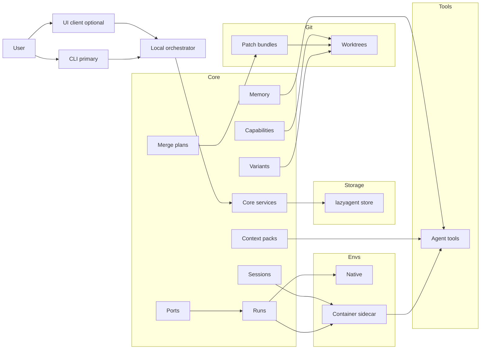

# Architecture diagram

Notes
- The daemon is the primary source of truth; CLI is the primary client, UI optional later.
- Adapters export into tool-specific configs in the repo (opencode.json, .cursor/rules).
- Context packs and merge plans are first-class artifacts stored locally.
