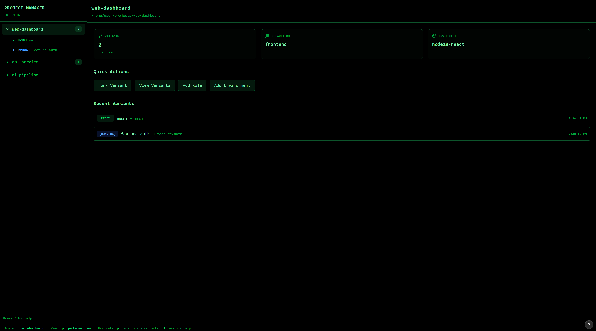
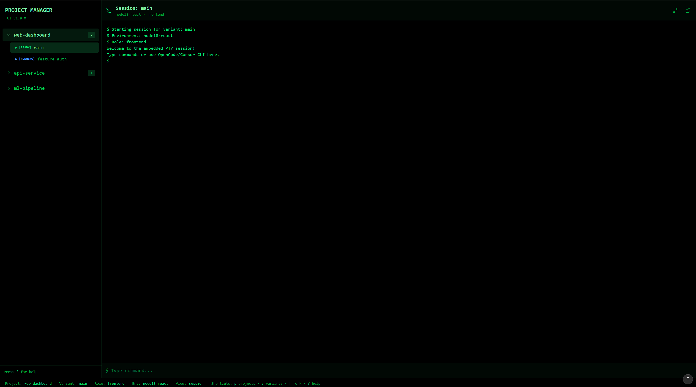

# UI/UX design doc (TUI-first)

## Mock

[figma make mockup](https://www.figma.com/make/EeKVsngadEeoWTRRdP5CRB/TUI-Project-Management-App?t=t56ebnKEv8vVGpIe-1)

## Goals
- Fast, keyboard-driven workflow for managing projects and variants.
- Keep main screen responsive; long tasks show in sidebar spinner.
- Make state visible: variants, context packs, env status, merge plan.
- Provide a clear path to open tool sessions (embedded PTY).

## Personas
- Solo builder: wants quick forking, visible context, low overhead.
- Tech lead: wants audit trail, repeatability, and merge confidence.
- Experimenter: likes rapid switching between variants and runs.

## UX principles
- Keyboard first, mouse optional.
- Single source of truth: sidebar lists projects and variants.
- Avoid modal lockups; show non-blocking progress.
- Explicit state labels: RUNNING, READY, ERROR, BUILDING.
- Optimistic UI with clear rollback paths.

## Information architecture
- Projects
  - Overview
  - Variants
  - Runs
  - Context packs
  - Environments
  - Merge plans
  - Settings

## Layout
- Left sidebar: projects and variants tree, status indicators.
- Main pane: detail view for the selected item.
- Right drawer (optional): logs, context pack, or diff preview.
- Status bar: active role, env profile, tool session, hints.

## Status indicators (ASCII)
- [READY] variant built and idle.
- [RUNNING] tool session active.
- [BUILD] initializing env or container.
- [ERROR] failed build or run.
- [WARN] drift detected or env overlay active.
- Spinner: "[BUILD] ..." shown in sidebar without blocking main view.

## Key views

### Project list
- List registered projects with last-opened timestamp.
- Quick actions: open, fork, settings, remove.
- Search: fuzzy project search with filters.

### Project overview
- Summary: default role, env profile, active variants, last run.
- Buttons: Fork, New Variant, Add Role, Add Env.

### Variant list
- Table of variants with status, base ref, role, env, last run.
- Actions: open session, archive, delete, build env.
- Search: fuzzy variant search with filters (status, role, env).

### Session view (embedded PTY)
- Full-height PTY pane for OpenCode/Cursor CLI.
- Header shows active variant and tool.
- Toggle: detach to external terminal if needed.

### Context pack inspector
- List of items with provenance (path, reason, size).
- Actions: pin, exclude, reorder, rebuild pack.

### Memory view
- Tabs: Decisions, Assumptions, Invariants, Candidates.
- Candidate approval with one-click promote.
- Conflict indicator when new entries collide with existing decisions.
- Restart prompt after promotion (with auto-restart toggle).

### Environment view
- Env spec summary: base image, features, packages.
- Drift summary: detected changes with promote/discard actions.
- Build history and last image digest.

### Ports view
- Logical to actual port mappings per variant.
- Copy-to-clipboard URLs.
- Quick switch for side-by-side comparisons (future proxy remap).

### Merge plan view
- Ordered list of patch bundles.
- Env spec merge summary (added/removed packages, file overrides).
- Run gates: lint/test/build status.
- Final action: apply merge or abort.

## Key flows

### Add project (TUI)
1. Add Project -> enter Git URL or local path.
2. If URL, clone into managed projects root.
3. Initialize workspace metadata.
4. Sidebar shows project with [BUILD] spinner if env init runs.

### Fork variant
1. Select project -> Fork.
2. Enter variant name.
3. Create worktree and start env build.
4. Sidebar shows [BUILD] spinner; main view remains usable.
5. On ready, user can open session (embedded PTY).

### Promote env changes
1. Env view shows drift summary.
2. Select changes to promote.
3. Regenerate spec + rebuild image in background.
4. Sidebar shows [BUILD] spinner; state updates on completion.

### Approve memories
1. Badge indicates new candidates.
2. Open Memory view and review candidates.
3. Approve/reject; conflicts must be resolved.
4. Prompt to restart sessions to apply updates.

## Keyboard shortcuts (initial set)
- `p`: project switcher.
- `v`: variant list.
- `f`: fork variant.
- `s`: open session.
- `c`: context pack inspector.
- `e`: environment view.
- `m`: merge plan view.
- `?`: help.

## Error handling
- Show errors inline with short reason and retry action.
- Persist error logs in run artifacts and link to them.
- Provide safe fallback: switch to native run if container fails.

## Accessibility
- High-contrast theme option.
- Configurable keybindings.
- Avoid color-only status signals; always use labels.

## VS Code/Cursor extension UX
- Sidebar tree mirrors TUI projects/variants.
- Actions: fork, open in devcontainer, view status.
- Uses same daemon API; no duplicate state.

## MVP scope
- TUI-only with embedded PTY and sidebar status.
- Project list, variant list, session view, env view.
- Merge plan view is read-only first, apply later.
- Memory view with candidate approval.
